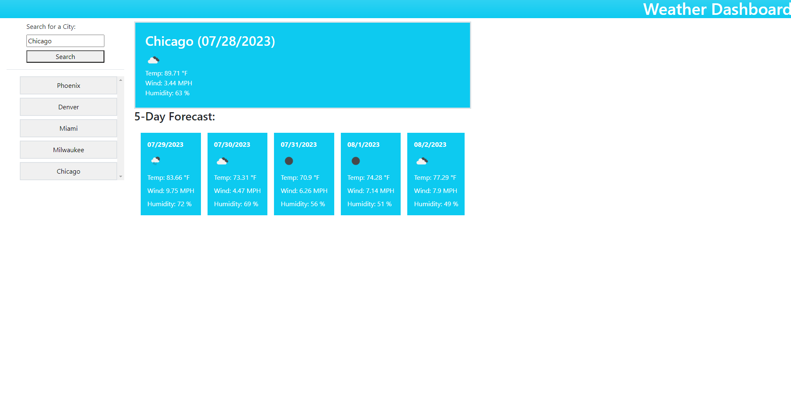

# Weather Dashboard

This challenge is for the fifth week of UMO coding bootcamp.

## Objective

The purpose of this challenge was to utilize the skills we learned regarding fetching data and displaying it in order to create a weather dashboard that displays current and future weather. When a valid city is searched the user will be presented with current and future data including the weather, temperature, wind speed, and humidity. Searches that provide valid cities will then appear in a list to the side to track the history of searches, those cities can be clicked and have their forecast be presented.

[Deployed Site](https://rodrjavi.github.io/weather-dashboard/)
